# Enterprise Workforce Management Platform
## Final Documentation

This document serves as the comprehensive reference guide for the Enterprise Workforce Management Platform, detailing its architecture, technology stack, modules, role-based access control, and user interface features.

---

## 1. Overview & Architecture

The Enterprise Workforce Management Platform is designed to digitize and automate the complete employee lifecycle—from recruitment to retirement—through a centralized web application. 

It is built as a **MERN stack** application in a monorepo structure, cleanly separated into `frontend` and `backend` services.

### Technology Stack
- **Frontend:** React, Vite, TailwindCSS
- **Backend:** Node.js, Express.js
- **Database:** MongoDB, Mongoose
- **Authentication:** JWT, bcryptjs
- **Real-time & Interactions:** Socket.IO, Puppeteer (for internal tasks)
- **Deployment:** Docker, docker-compose

---

## 2. Role-Based Access Control (RBAC)

The platform supports multiple distinct user roles, each with access to specific features and modules. The current roles are:

1. **Super Admin**: Full access to all modules, system configurations, and cross-department overviews.
2. **Organization Admin**: Access to organization-wide data (Payroll, Analytics, Projects, Performance).
3. **HR Manager**: Focuses on personnel management, recruitment, payroll, performance, and documents.
4. **IT Administrator**: Focuses on asset tracking and helpdesk configuration.
5. **Employee**: Access to their own data, attendance logging, personal tasks, and internal ticketing.

---

## 3. Core Modules & Features

The following sections highlight the core modules. Screenshots taken from the current UI are included for reference.

### 3.1 Authentication & Login
The login page provides a magnetic, interactive input field and supports role-based login to redirect users to their appropriate dashboard.
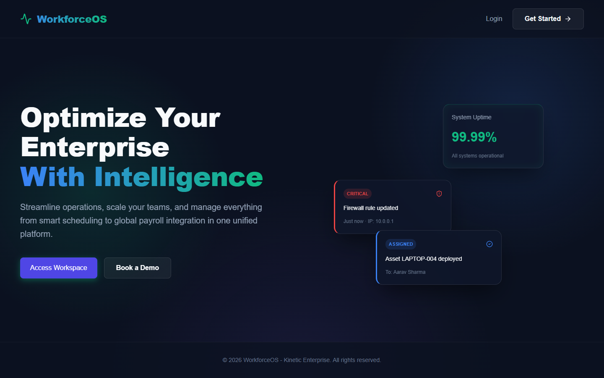

### 3.2 Dashboard
The main dashboard gives a summarized view of workforce metrics depending on the user's role.
- **Super Admin Dashboard**
  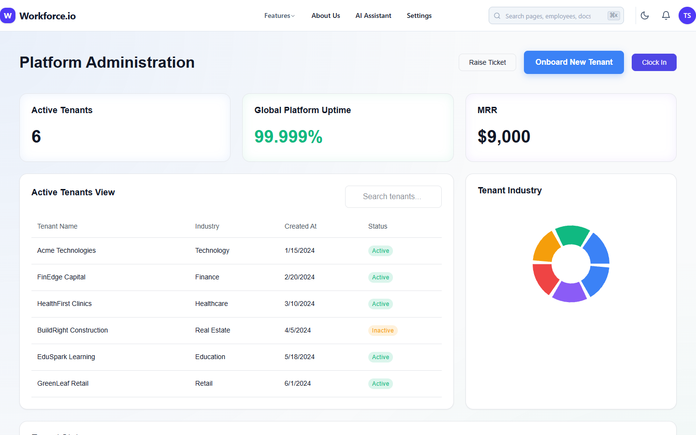
- **Employee Dashboard**
  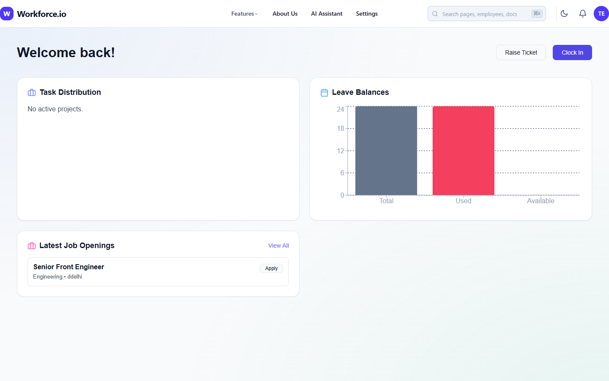

### 3.3 Attendance & Leave
Employees can log attendance, check-in/out, and request leaves. Managers can review and approve leave requests.
- **Attendance Board**
  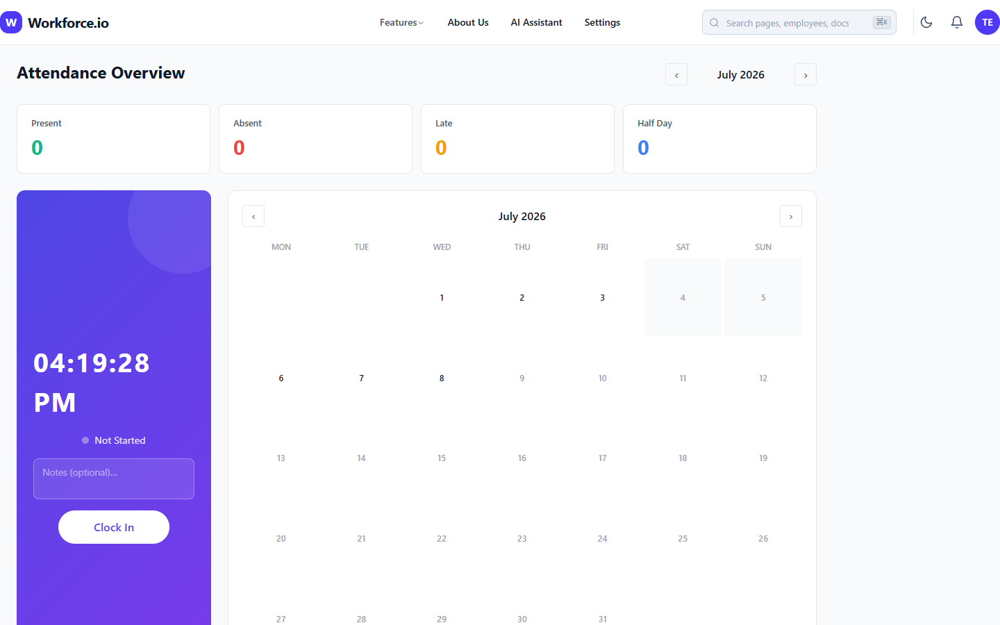
- **Leave Management**
  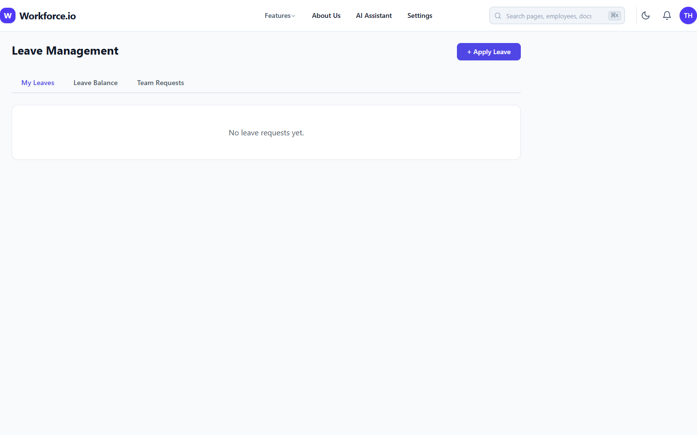

### 3.4 Employee Directory & Recruitment
HR Managers and Admins can view employee lists, add new employees, and track recruitment pipelines (applicants, screenings, interviews).
- **Employee List**
  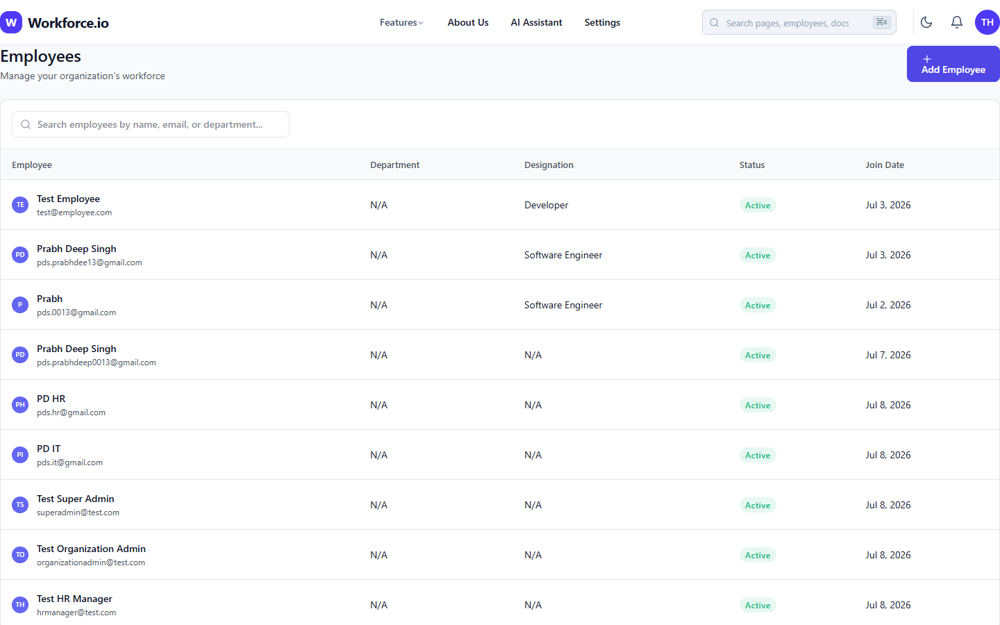
- **Recruitment Pipeline**
  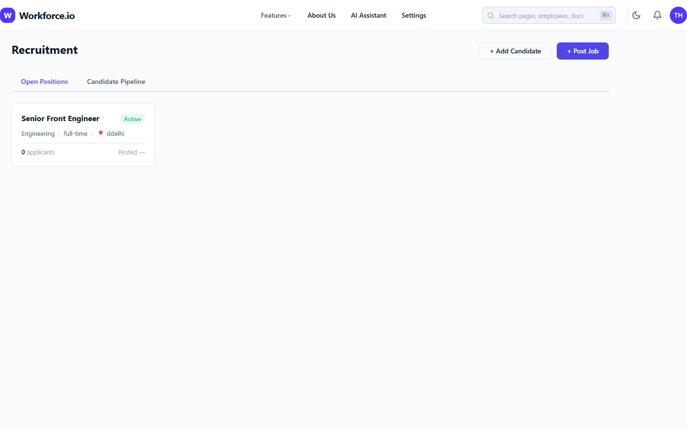
- **Internal Jobs Board**
  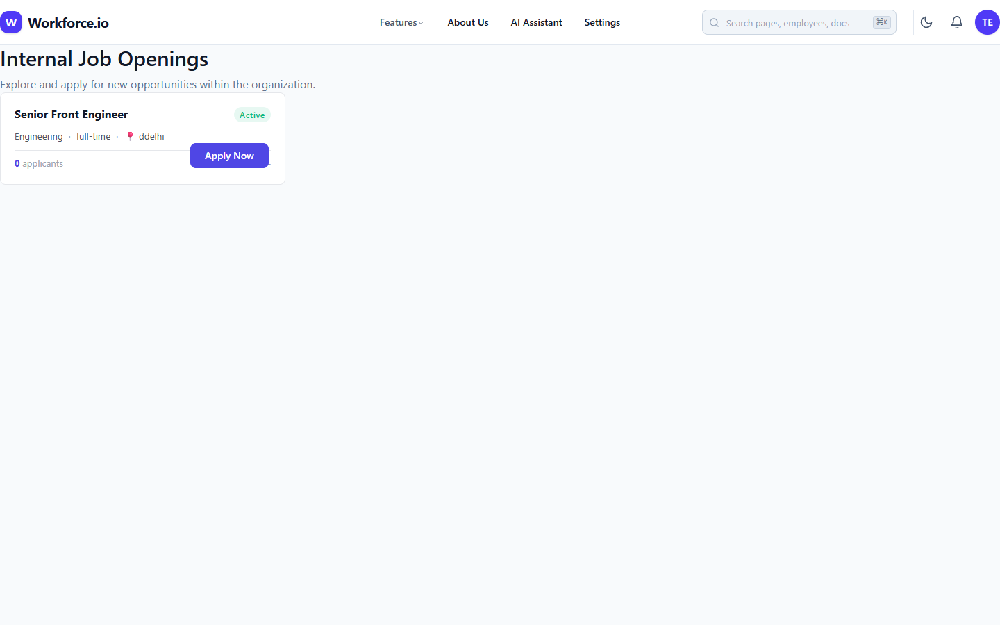

### 3.5 Projects & Tasks
Project management tools for creating tasks, organizing boards (To Do, In Progress, Review, Done), and assigning them to workforce members.
- **Project Tasks**
  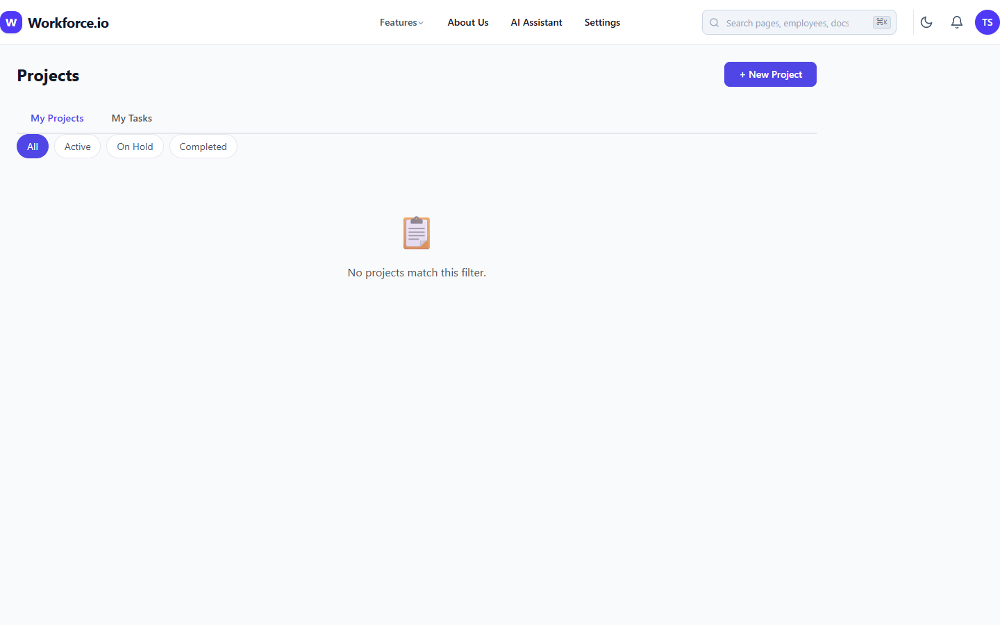

### 3.6 Performance & Payroll
Tools for evaluating performance goals and reviews, along with managing salary components, allowances, and deductions.
- **Performance Appraisals**
  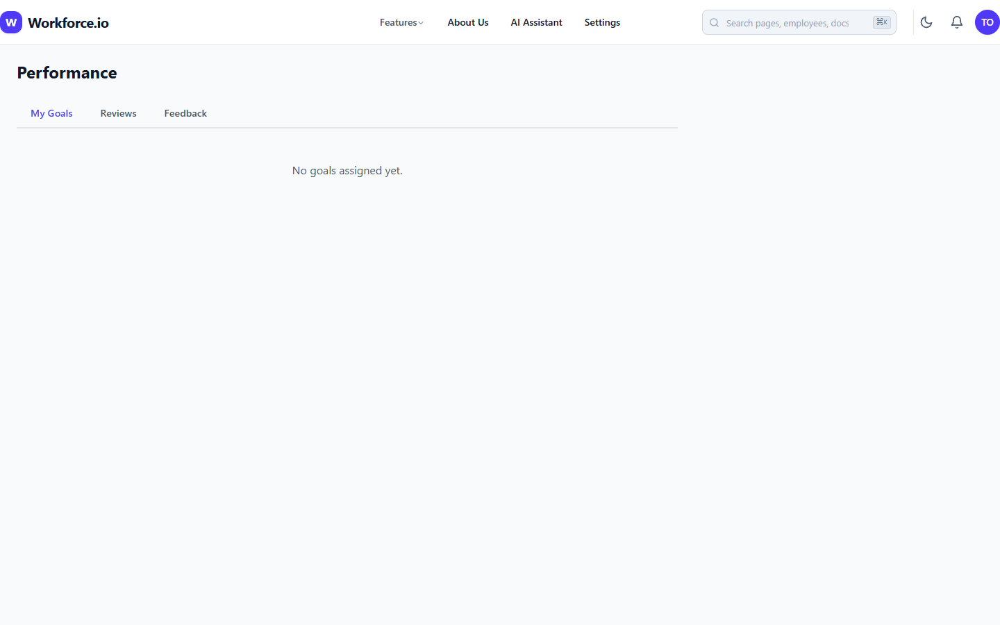
- **Payroll System**
  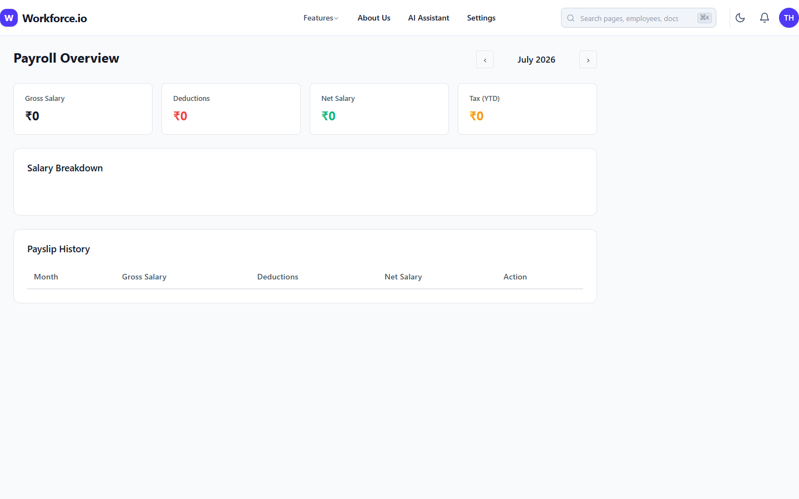

### 3.7 Assets & Helpdesk
IT Admins can keep an inventory of hardware/software. All employees can raise IT or HR support tickets.
- **Asset Inventory**
  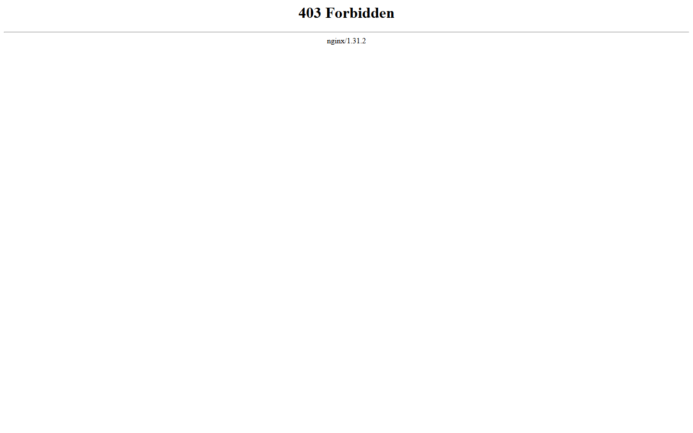
- **Helpdesk Ticketing**
  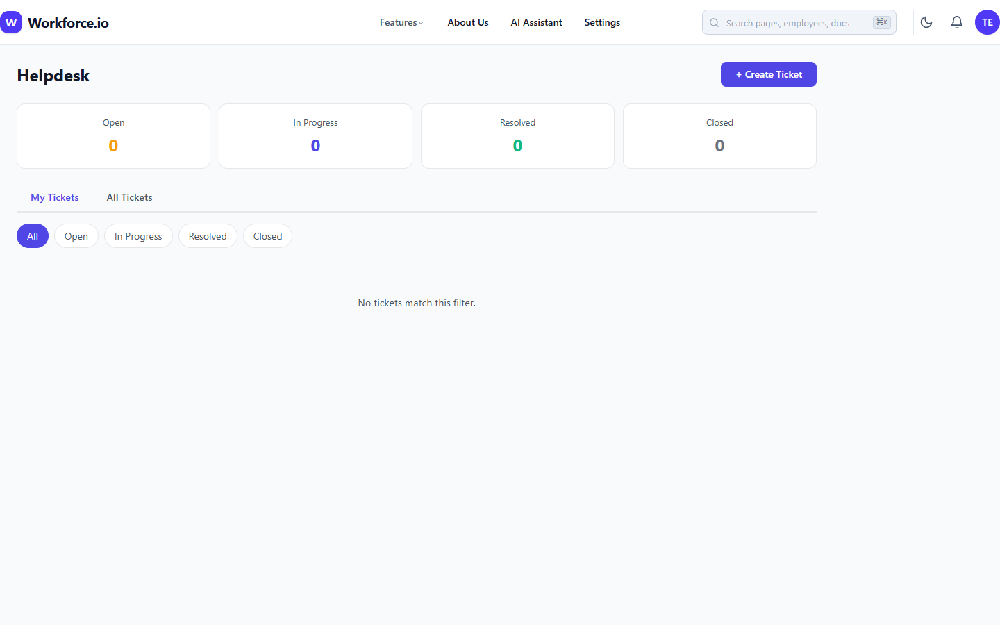

### 3.8 Documents
A centralized, role-aware file repository for offer letters, payslips, contracts, and policies.
- **Document Hub**
  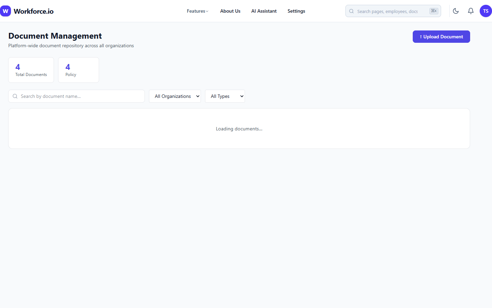

### 3.9 Analytics & Settings
Visualizations for HR metrics (retention, headcounts, diversity) and platform settings.
- **Analytics Charts**
  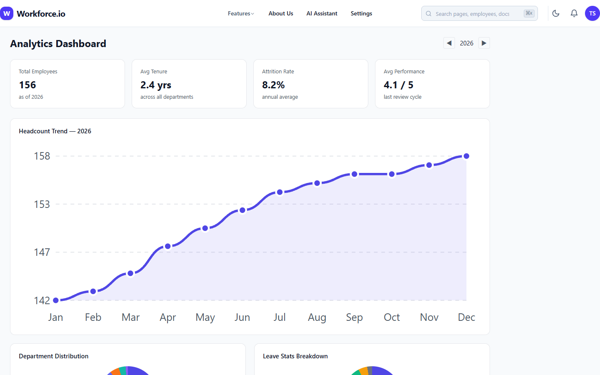
- **Settings & Profile**
  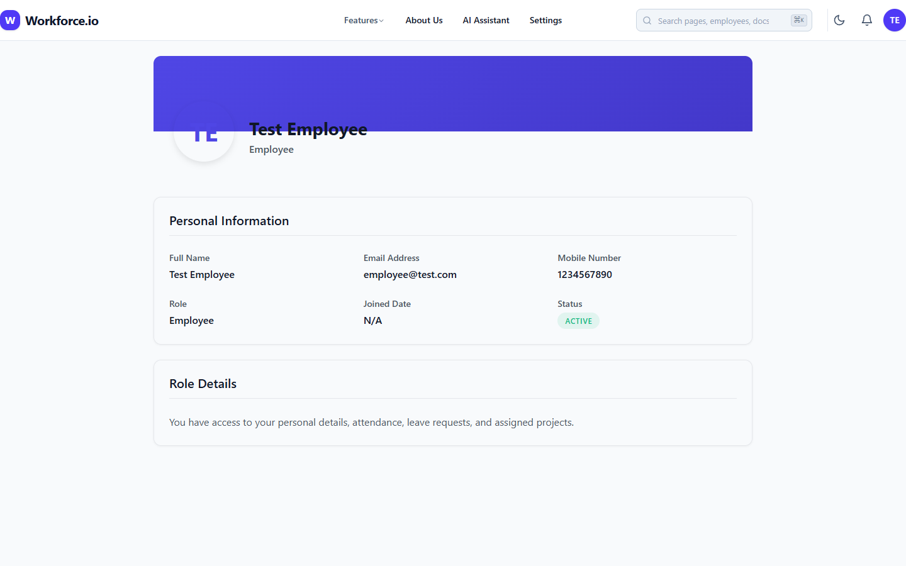

---

## 4. Deployment

The application is containerized with Docker. To run the full stack:

```bash
docker-compose up --build -d
```
- Frontend: `http://localhost` (Port 80)
- Backend: `http://localhost:5000` (Port 5000)
- Database: MongoDB is automatically provisioned inside the Docker network.

## 5. Development

For local development (without Docker):
```bash
# Terminal 1: Backend
cd backend
npm run start

# Terminal 2: Frontend
cd frontend
npm run dev
```

*Generated automatically through platform integration tools.*
